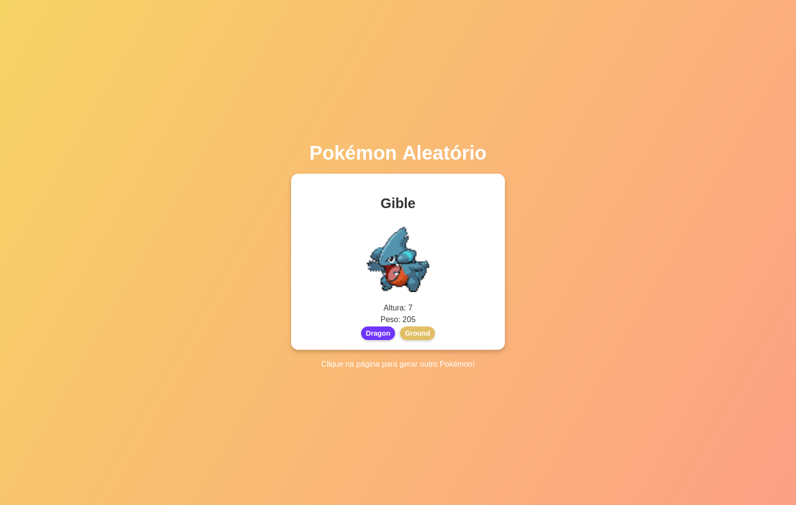

# Pokémon Aleatório com React e Vite

Este projeto é uma aplicação web que exibe informações de um Pokémon aleatório ao carregar a página ou clicar nela.
Utiliza a [PokeAPI](https://pokeapi.co/) para obter os dados do Pokémon e React para a interface do usuário, com Vite
como ferramenta de construção.


## 🚀 Funcionalidades

- Exibe um Pokémon aleatório ao carregar a página.
- Mostra as seguintes informações do Pokémon:
    - Nome
    - Altura
    - Peso
    - Tipos com estilização colorida semelhante aos jogos originais.
    - **Sprite animado (GIF)** se disponível.
- Responsivo e estilizado para funcionar bem em dispositivos móveis e desktops.
- Recarrega um novo Pokémon ao clicar na página.

## 🛠️ Tecnologias Utilizadas

- [React](https://reactjs.org/)
- [Vite](https://vitejs.dev/)
- [PokeAPI](https://pokeapi.co/)
- CSS (responsividade e estilos modernos)

## 📦 Como Executar o Projeto

Siga as etapas abaixo para rodar o projeto localmente:

### Pré-requisitos

Certifique-se de ter o [Node.js](https://nodejs.org/) instalado em sua máquina.

### Passo a passo

1. Clone o repositório:
   ```bash
   git clone https://github.com/seu-usuario/nome-do-repositorio.git
   cd nome-do-repositorio
   ```

2. Instale as dependências:
   ```bash
   npm install
   ```

3. Inicie o servidor de desenvolvimento:
   ```bash
   npm run dev
   ```

4. Abra o navegador no endereço:
   ```
   http://localhost:5173
   ```

5. Clique na página para gerar novos Pokémon aleatórios!

## 🖼️ Demonstração



## 🔧 Estrutura do Projeto

```
📂 src
 ┣ 📂 components   # Componentes do projeto (opcional)
 ┣ 📜 App.jsx      # Código principal da aplicação
 ┣ 📜 App.css      # Estilização da aplicação
 ┗ 📜 main.jsx     # Ponto de entrada do React
```

## 🌐 API Utilizada

O projeto utiliza a [PokeAPI](https://pokeapi.co/) para obter os dados e sprites dos Pokémon.

### Exemplo de requisição:

```bash
GET https://pokeapi.co/api/v2/pokemon/{id}
```

### Resposta:

```json
{
  "name": "charizard",
  "height": 17,
  "weight": 905,
  "types": [
    {
      "type": {
        "name": "fire"
      }
    },
    {
      "type": {
        "name": "flying"
      }
    }
  ],
  "sprites": {
    "front_default": "https://raw.githubusercontent.com/...",
    "versions": {
      "generation-v": {
        "black-white": {
          "animated": {
            "front_default": "https://raw.githubusercontent.com/..."
          }
        }
      }
    }
  }
}
```

## 🤝 Contribuindo

Contribuições são bem-vindas! Sinta-se à vontade para abrir **issues** ou enviar **pull requests**.

### Para contribuir:

1. Faça um fork do repositório.
2. Crie uma branch para a sua funcionalidade:
   ```bash
   git checkout -b minha-nova-funcionalidade
   ```
3. Faça as alterações e commit:
   ```bash
   git commit -m "Adiciona minha nova funcionalidade"
   ```
4. Envie as alterações:
   ```bash
   git push origin minha-nova-funcionalidade
   ```
5. Abra um pull request.

## 📜 Licença

Este projeto está licenciado sob a licença **MIT**. Consulte o arquivo [LICENSE](LICENSE) para mais informações.

---
